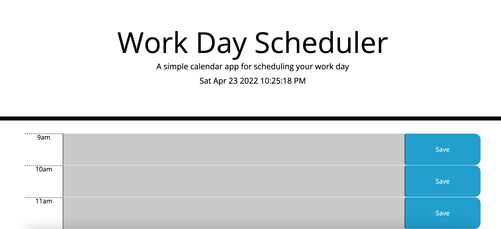

# Work-Day-Scheduler
Calendar application that I created using HTML, CSS, and JavaScript that allows the user to save events for each hour of the day.

# Description
This application was created to allow employees with busy schedules to add events to a daily planner to help them manage their time better. The application webpage displays the current time and uses a series of timeblocks to display each hour of the day. Each timeblock is color coded to show past, present, and future times to help the user easily see what tasks they have completed and having coming up. The user is allowed to add and change the text within each timeblock to reflect what events they have each day, and they are able to save these events to their devices local storage so that they can return to view their schedule as needed throughout the day. 

The application uses JavaScript and jQuery methods to allow the user to interact with the webpage and execute functions such as viewing current time, adding events, and saving events to local storage. Building this application allowed me to further develop JavaScript skills together with other methods such as jQuery to further enhance the user experience within the application. 

# Usage
My work day scheduler application can be accessed at https://dennismacc.github.io/Work-Day-Scheduler/ and the source code can be viewed at GitHub page (dennismacc) under the Work-Day-Scheduler repository.

